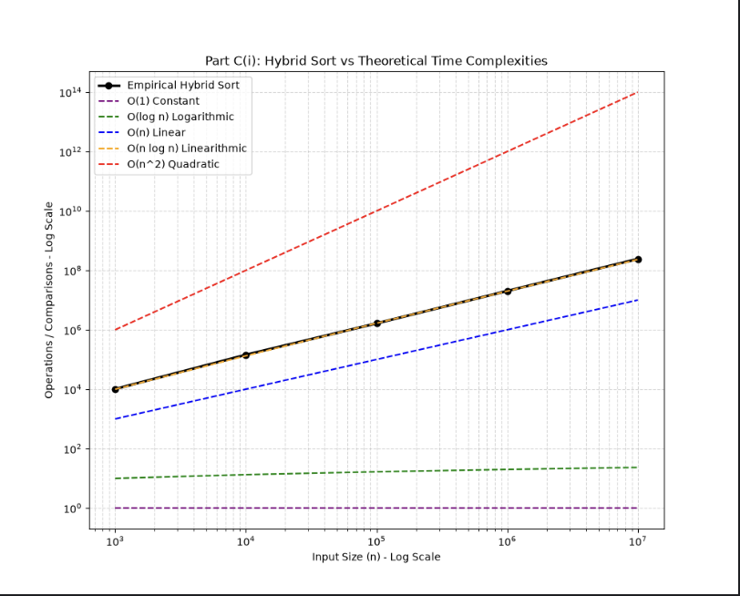
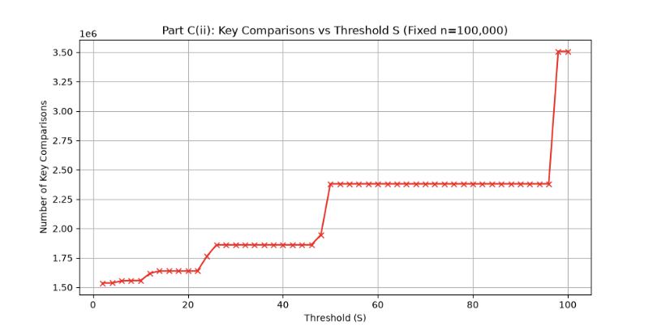
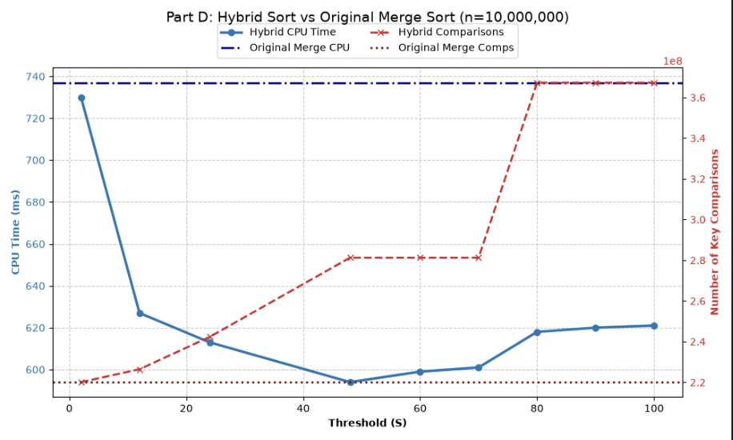

```markdown
# SC2001 Project 1: Hybrid Sorting Algorithm (Merge Sort & Insertion Sort)

## Part C(i): Theoretical vs. Empirical Analysis (Varying n)



**Observation:** 
When plotting the number of key comparisons against varying input sizes (`n`) on a log-log scale, the average comparisons made using Hybrid sort matches the O(nlogn) runtime

**Analysis:** 
The data confirms our theoretical expectations. While the hybrid algorithm introduces Insertion Sort at the base level, Insertion Sort only handles very small, fixed-size arrays capped at size `S`. Because `S` is a constant threshold, the `O(S^2)` complexity of Insertion Sort acts as a constant factor `O(1)` when compared to the very large input size n. Therefore, the constant recursive division still dominates the growth rate, meaning the hybrid algorithm keeps Merge Sort's optimal linearithmic `O(n log n)` time complexity.

---

## Part C(ii): Theoretical vs. Empirical Analysis (Varying S)



**Observation:** 
Graphing the number of key comparisons against varying threshold values (`S`) on a fixed array size (`n = 100,000`) reveals a distinct "staircase" pattern. The absolute minimum number of key comparisons occurs at `S = 2`. 

**Analysis:** 
As `S` increases, the algorithm delegates larger subarrays to Insertion Sort. Because Insertion Sort compares elements quadratically `O(S^2)` and is not as efficient as Merge Sort's linear merging `O(S)`, larger values of `S` guarantees an increase in raw key comparisons.

**The Staircase Effect:** 
The graph exhibits long flat ranges followed by sudden vertical jumps. This occurs because Merge Sort divides the array by halving it. For example, if an array of 100,000 halves down to a subarray of size 48 from a size of 96, any threshold `S` between 49 and 95 will stop the recursion at the exact same depth.This leaves the same size of subarrays for Insertion sort to work on, therefore the total number of key comparisons remains identical, creating the flat steps on the graph.

---

## Part C(iii): Determining the Optimal Threshold (S)

**Analysis:** 
Determining the "optimal" `S` depends entirely on the evaluation metric:
*   **Minimizing Key Comparisons:** If optimizing strictly to minimize mathematical key comparisons, the Part C(ii) graph proves that `S = 2` is optimal.
*   **Minimizing CPU Time (Real-World Performance):** CPU time is the critical metric for real-world software. Based on the benchmarking done, the CPU time drops to its absolute minimum at `S = 48`. 

**Conclusion:** 
`S = 48` is the true optimal threshold because it strikes the perfect balance. It is large enough to reduce thousands of expensive recursive function calls and memory allocations, but small enough that Insertion Sort's quadratic runtime doesn't drag down the overall performance.

---

## Part D: Comparison with Original Merge Sort



**Observation:** 
When benchmarking both algorithms on a massive dataset of 10,000,000 integers, the Hybrid Sort's CPU execution time stays consistently below the original Merge Sort's baseline. Conversely, the number of key comparisons performed by the Hybrid Sort eventually crosses above the original Merge Sort's baseline as `S` grows past 24.

**Analysis:** 
The hybrid algorithm is definitely faster in execution time than the original Merge Sort (dropping from roughly 738 ms down to under 600 ms at optimal `S`). 

The relationship between the CPU time dropping while key comparisons rise highlights a critical concept in algorithm design: **even when the hybrid algorithm performs more mathematical key comparisons than the original Merge Sort, it still finishes faster.** The system overhead saved by skipping deep recursive calls easily outweighs the computational cost of performing slightly more key comparisons in a simple `for` loop.

```
